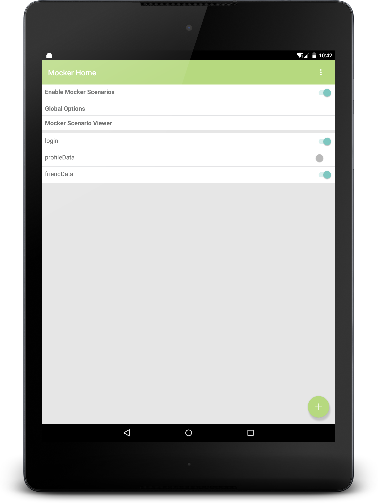
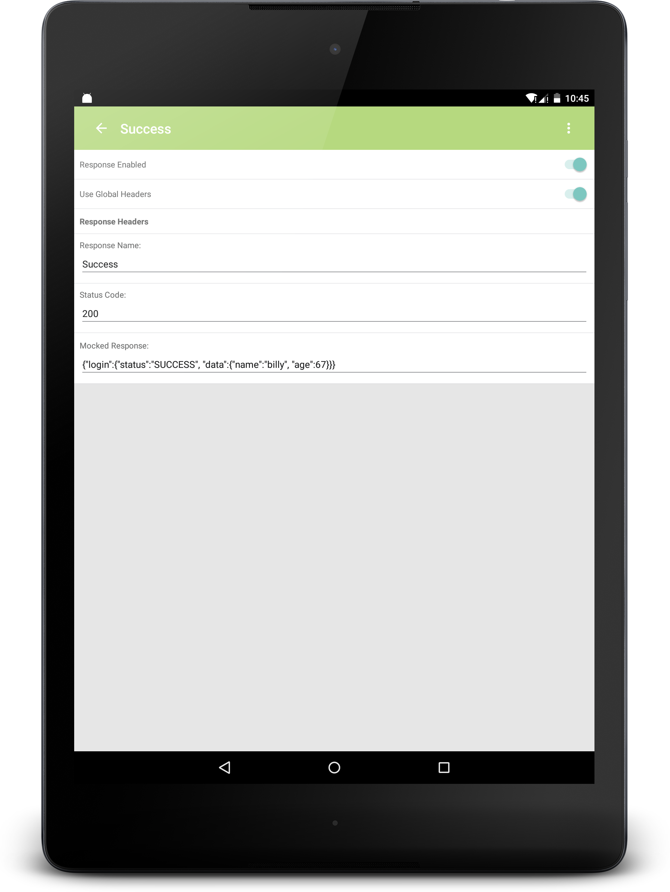
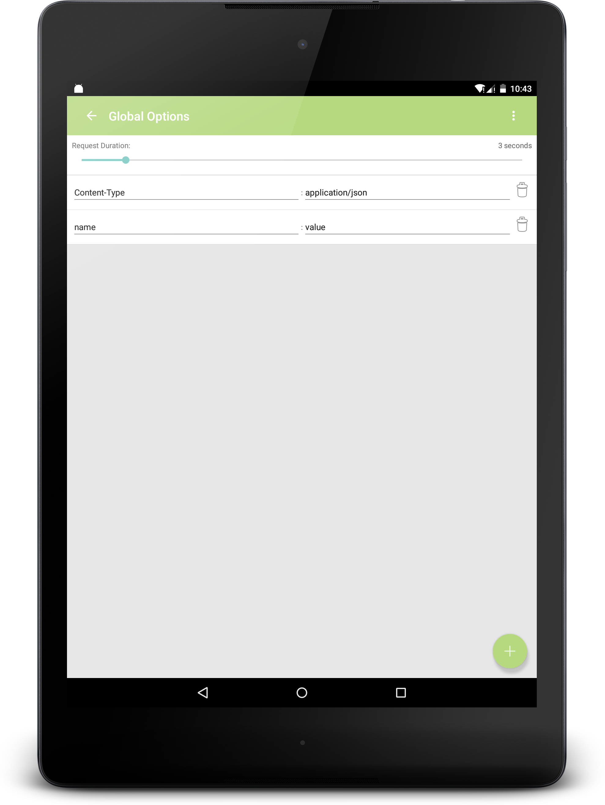

# Mocker

A response Mocking framework for Android applications using the OkHTTP3 client.

Mocker allows you to create mocked responses for your requests at runtime without running a special build. Each with the ability 
to be toggled on and off individually so that you may test one specific service call without affecting the rest of your application.
Mocker also gives you the ability to create mocked responses from real requests and responses being made by your application. This is useful
when you need to be sure that you can recreate a scenario over and over again without relying on your service tier to remain unchanged.
All this in a simple to follow UI which is launched by selecting the notification that appears when your application is launched. 



## Getting started

*Currently Mocker is offered as a Maven dependency or by using a local copy of the repository*

**Using Maven Dependency**

In your `build.gradle`:
```gradle
repositories {
  maven { url 'https://github.com/teegarcs/Mocker/raw/master/'}
}
 dependencies {
  debugCompile 'com.teegarcs.mocker:debug:1.1.0@aar'
  releaseCompile 'com.teegarcs.mocker:release:1.1.0@aar'
 }
```
*There is a release and a debug build for convenience only. The purpose of the release build is to provide the barebones Mocker project so that you do not have to manually remove any code when making a production build. The release build contains the methods used in your code but removes the rest of its dependencies.*

**Using Local Repository**

To begin, first clone the Mocker repository to your workstation. 

Next in the application you wish to add Mocker to, open the ```settings.gradle``` file and add the following:

```gradle
  include ':mocker'
  project(':mocker').projectDir = new File(settingsDir, "../mocker/library")
```
Where the settings directory is the path to your mocker project. The /library is needed after the path.  

In your `build.gradle`:
```gradle
 dependencies {
  releaseCompile project(path: ':mocker', configuration: 'release')
  debugCompile project(path: ':mocker', configuration: 'debug')
 }
```
###Initializing Mocker
In your `Application` class:

```java
public class ExampleApplication extends Application {

  @Override public void onCreate() {
    super.onCreate();
    MockerInitializer.install(this);
  }
}
```

In your `OkHttpClient` builder:

```java
OkHttpClient.Builder builder = new OkHttpClient.Builder();
        builder.addNetworkInterceptor(MockerInitializer.getMockerInterceptor(context));
        builder.addInterceptor(MockerInitializer.getMatchingInterceptor(context)); //only needed if you wish to match
        ......
        return builder.build();
```

**You're all set!** Mocker will automatically show a notification once your application is launched which,
will be your entry point into Mocker. The notification will automatically dismiss itself once the application is closed. 

## How do I use Mocker?

###Mocker Home

The below screen shot is the entry point into Mocker. From here you can disable all mocked responses or enable Mocker to allow individual 
selections to be made.  You can also select, "Global Header" which are headers attached to every mocked response.  Select any scenario 
to enter into the individual editing or select the add action button to add a new scenario.  

*From every screen you have the ability to turn Mocker Matching on which enables you to create mocked responses based on real requests/responses
made. Mocker simply monitors the traffic of your application and automatically generates scenarios and responses for you. When Mocker Mathing is enabled, all mocker scenarios are considered disabled and your real request will be made.  To enable Mocker Matching, toggle it on using the overflow menu.  To disable Mocker Matching, open the notification and select the disable action or toggle it back off via the overflow menu.*


###Mocker Scenarios

The below screen shot is where you can edit a specific scenario.  From here you can change the name of your scenario, update the url pattern, 
and create more mocked responses. The to add wild cards to your Url pattern place the following brackets as desired {}. The url pattern 
is what is leveraged in order to match an outgoing request from your application to a mocked response.  From this screen you can also delete 
the scenario via the overflwo menu. 


###Mocked Responses

The below screen shot is where you can edit a specific mocked response.  From here you can change the name of the response, change the status
code, and updated the mocked response coming back.  You also have the ability to adjust whether you want the response to inherit global headers 
and assign response specific headers as desired.  In the overflow menu you will find the ability to delete the response.  



###Headers and Request Durations

The below screen shot is where you can edit global headers and response specific headers depending upon your selection. You also have the ability to adjust how long you would like each request to take by simply dragging the slider from 1 to 30 seconds.  



Mocker also gives you the ability to *Share* your entire Mocker setup.  This is useful when you would like to share what you have set up with 
a colleague.  To leverage what one has shared with you, open the Mocker library project in your local repository and find the MockerDock.json 
file located in the assets folder. Paste your shared json here and relaunch.  

##Saving

Mocker has three mechanisms for saving: the local cache (memory), the disk cache, and the default assets file referenced in the last step above.
Any changes you make to your Mocker setup is automatically saved to memory.  However, in order to persist this data you must press save found in the 
overflow menu. If save is not pressed, your changes will be lost.  Once you press save, a disk cache will be made. From here on out Mocker 
will default to using your setup found inside of your disk cache.  If no disk cache is present Mocker uses the MockerDock file found in the 
Assets directory of the Mocker project.  

##Sharing Mocker Configuration
You can set up your own default file to be used for easy sharing in your applications repository by using the following code inside of your `Application` class.  Just simply pass your default file name inside of the install method and your file will be used rather than the default file found inside of the Mocker asset folder. Note that this will only work if the file you are passing in resides in your application's asset folder.  

For convenience you can share the entire Mocker json from the local cache on any Mocker screen as plain text.  You may also find it useful to manually copy the desired json from Mocker's json viewer.  After retrieving the json configuration text, just paste the text into your default asset file created in your application's asset folder for later use and reuse by your teammates. 

```java
public class ExampleApplication extends Application {

  @Override public void onCreate() {
    super.onCreate();
    MockerInitializer.install(this, "yourjsonfile.json");
  }
}
```

## License

    Licensed under the Apache License, Version 2.0 (the "License");
    you may not use this file except in compliance with the License.
    You may obtain a copy of the License at

       http://www.apache.org/licenses/LICENSE-2.0

    Unless required by applicable law or agreed to in writing, software
    distributed under the License is distributed on an "AS IS" BASIS,
    WITHOUT WARRANTIES OR CONDITIONS OF ANY KIND, either express or implied.
    See the License for the specific language governing permissions and
    limitations under the License.
